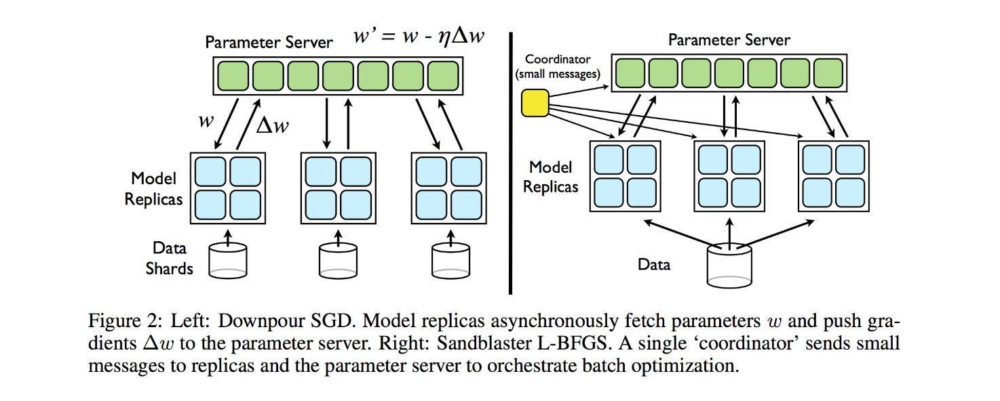
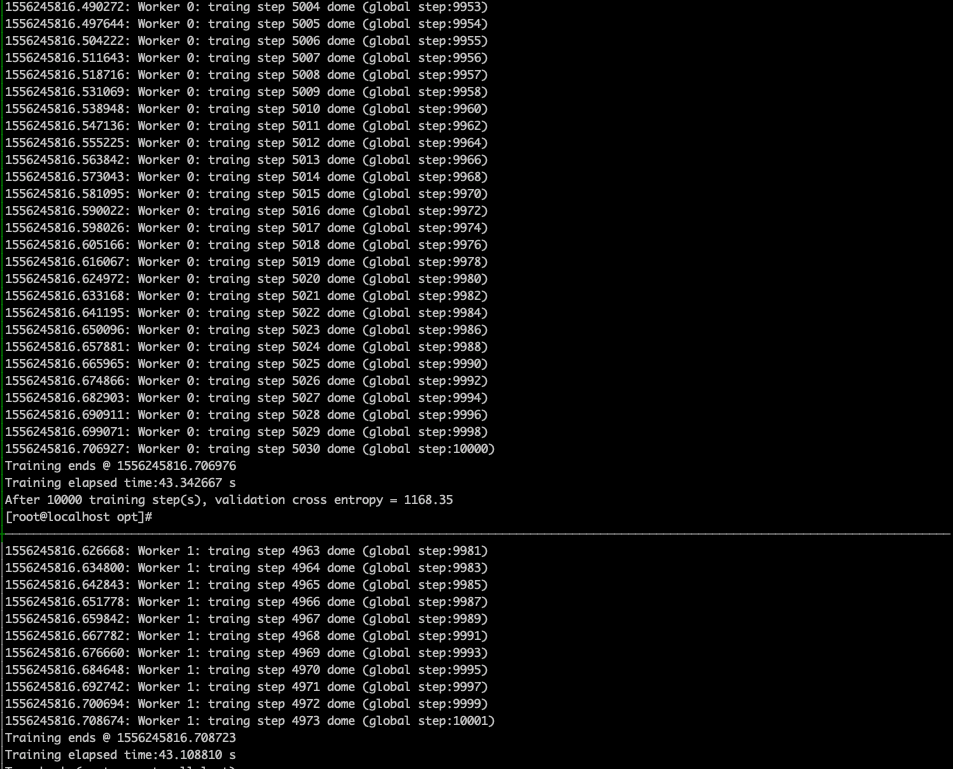

## Tensorflow分布式计算

关于Tensorflow分布式计算的介绍，就不得不介绍关于其底层核心思想，核心实现———DistBelief,关于其的详细的介绍可以从[这篇文章](https://note.youdao.com/)中得知。下面简单的说明一下其中的几个核心点。

首先，DistBelief 不支持 GPU，而是使用 CPU 集群 (CPU 核数量级 ~10^5) 来训练。对此，文章的解释是：
>A known limitation of the GPU approach is that the training speed-up is small when the model does not fit in GPU memory (typically less than 6 gigabytes). To use a GPU effectively, researchers often reduce the size of the data or parameters so that CPU-to-GPU transfers are not a significant bottleneck. While data and parameter reduction work well for small problems (e.g. acoustic modeling for speech recognition), they are less attractive for problems with a large number of examples and dimensions (e.g., high-resolution images).

DistBelief 支持多机并行的方法是 Model parallelism，也就是把同一个模型的参数划分到不同的 Parameter server 里去。和其他过去采用 MPI 方法的系统相比，Parameter server 的设计是 DistBelief 最大的特点。此外 DistBelief 还支持 Data parallelism。当数据量很大时，每个 Model replica (在其他工作中通常叫做 Worker) 可以使用不同的 Data Shard。

>MPI——全程为Message Passing Interface，是一种跨语言的通讯协议，用于编写并行计算程序，支持进程间点对点的通信和广播。详细的MPI介绍可以借助[这篇文章](https://computing.llnl.gov/tutorials/mpi/)。

**Downpour SGD 和 Sandblaster L-BFGS**

Downpour SGD 实际是 Parameter server 中的异步 SGD， Parameter server 相当于一个分布式的 Key-value 数据库。异步 SGD 除了效率更高之外，容错能力也更强：一台机器故障不会影响整体训练的进行。Downpour SGD的主要思想是，将训练集划分若干子集，并对每个子集运行一个单独的模型副本。模型副本之间的通信均通过中心参数服务器(parameter server, ps)组，该参数服务器组维护了模型参数的当前状态，并分割到多台机器上（例如，如果我们参数服务器组有10个节点，那么每个节点将负责存储和更新模型参数的1/10

 Sandblaster的主要思路是将参数的存储和操作分布化，算法（如L-BFGS）的核心位于协调器（coordinator）中。该协调器并不直接获取模型参数，相反地，它发出一系列命令（如内积，向量缩放，系数相关加法，乘法）到参数服务器节点，并且这些命令能在节点范围内执行。
 在典型的L-BFGS的并行实现中，数据被分布到许多机器上，每个机器负责对样本数据的某个特定子集计算梯度，然后梯度值被传输回中心服务器。因为许多方法需要等待处理最慢的机器处理完毕，所以它很难扩展到大型共享集群中。为了解决该问题，Sandblaster采用了如下的方案：协调器分配给这N个模型副本一小部分的任务量，并且该计算任务远小于总批量，每当副本完成计算处于闲置状态时，立即给其分配新的计算任务，如此下去。为了在整个批量计算的最后阶段进一步优化慢速副本的任务处理，协调器调度最快结束的副本同时计算未完成的任务，从最先结束的副本处取得计算结果。

 **gRPC**
 gRPC是google开源的一个rpc框架，并应用在Tensorflow分布式底层的实现中。关于grpc的介绍如下：
 >gRPC是一个高性能、通用的开源 RPC 框架，其由 Google 主要面向移动应用开发并基于HTTP/2协议标准而设计，基于ProtoBuf(Protocol Buffers) 序列化协议开发，且支持众多开发语言。gRPC 提供了一种简单的方法来精确地定义服务和为 iOS、Android 和后台支持服务自动生成可靠性很强的客户端功能库。客户端充分利用高级流和链接功能，从而有助于节省带宽、降低的 TCP 链接次数、节省 CPU 使用、和电池寿命。

 特点：
 - gRPC使用ProtoBuf定义服务，ProtoBuf是由Google开发的一种数据序列化协议（类似于XML，JSON）。当前gRPC仅支持Protobuf，并且不支持在浏览器使用。
 - 基于http/2标准设计，相对其他RPC，gRPC由很多强大的功能，如双向流、头部压缩、多复用请求等。这些功能给移动设备带来重大益处，如节省带宽、降低 TCP 链接次数、节省 CPU 使用和延长电池寿命等。同时，gRPC 还能够提高了云端服务和 Web 应用的性能。gRPC 既能够在客户端应用，也能够在服务器端应用，从而以透明的方式实现客户端和服务器端的通信和简化通信系统的构建。

**关于测试结果**

**测试环境**

- Tensorflow 1.5.0
- 3台8核8G机器

